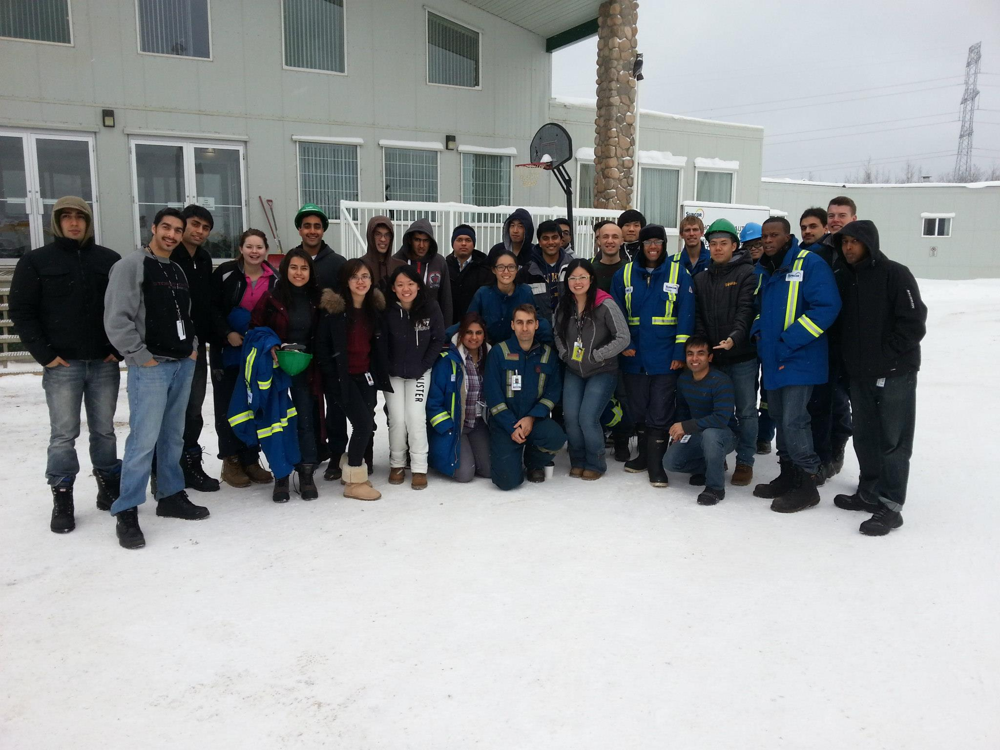
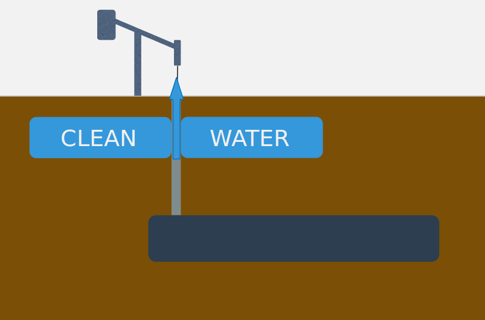
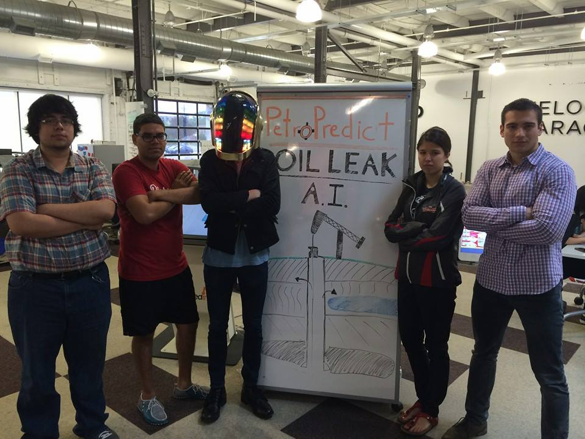
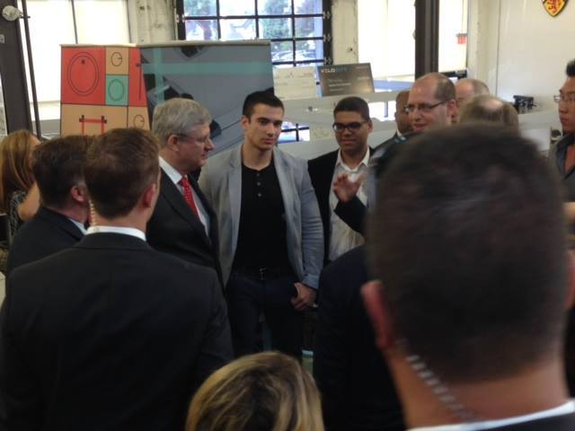
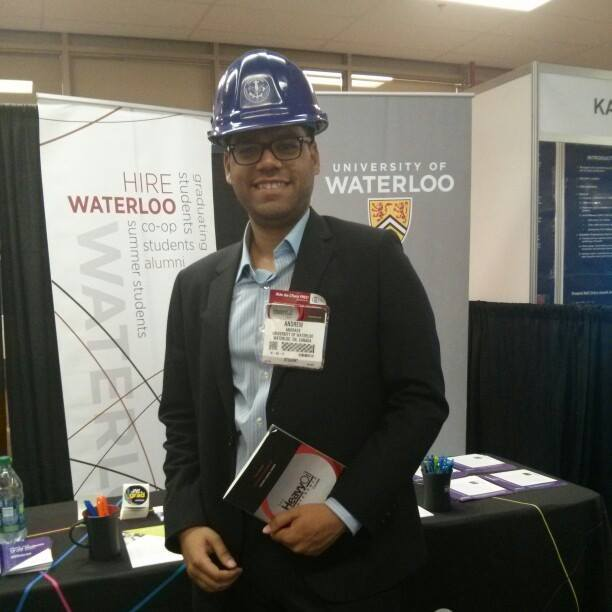
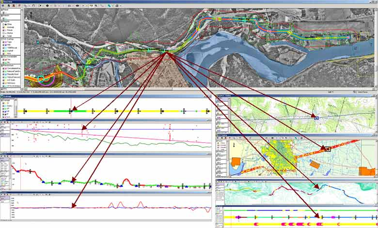
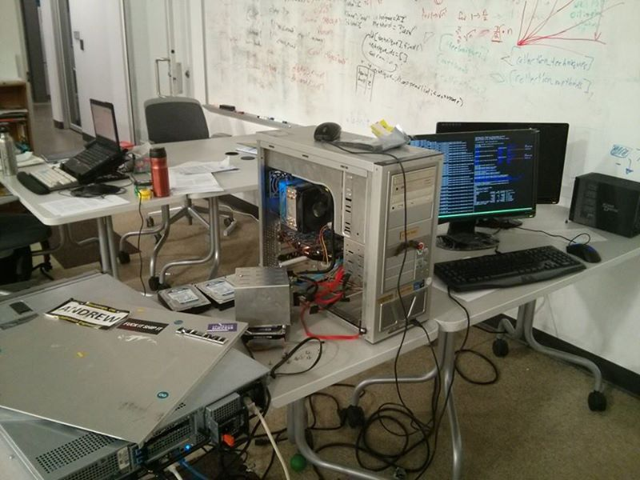

# What's your problem?

https://www.youtube.com/watch?v=3gl31Rof9Zs

Taken from:

[beastar.uwaterloo.ca](http://beastar.uwaterloo.ca)

https://www.youtube.com/watch?v=ctGzhSwB9W0

# Reservoir Engineering @Suncor

# Killer Problem: Casing Leaks

# Manufacturing Engineering @Facebook

# Data Analytics and Machine Learning

Learnt things from Udacity.com 

# Founding PetroPredict

# Life's a Rollercoaster 

# Oil price

# Global Petroleum Show

# Learning: Business Need Comes First!

## Pivot: Pipeline Risk

Taken from: http://www.mero.cz/

# Running Servers

# SPE research

Literary Database:
[onepetro.org](http://onepetro.org)

# Multifaceted Approach to Oil Field Segment Analysis

# SPE Paper Content

# Winning!

# Singapore!

# Carbon Emissions are Increasing!

Cold Cash, Cool Climate, Chapter 2 figure 2-12

# Global Temperature in Increasing!

Cold Cash, Cool Climate, Chapter 2 figure 2-16

# Complex relation between GHG and Temperature

EPICA Dome C temperature data: (dark blue) Vostok CO2 data: (steel blue) EPICA DomeC temperature data, 423-391 kybp: (pale blue) EPICA DomeC CO2 data, 650-413 kybp: (cyan) EPICA DomeC CO2 data, 800-650 kybp: Current CO2 level:

# Fossil Fuel and GHG 

# Petroleum 2.0 and OCI

# Global Energy Flow 

# US energy

# 2014 Global Energy Consumption

# 2035 Global Energy Consumption

# Are we running out of oil and gas?

NO!

# Do we need Petroleum?

YES!  We have a moral case

# How am I going to innovate:

# FYDP: Energy Storage: EV Batteries

# Battery system

[mrandrewandrade.com/blog](http://mrandrewandrade.com/blog)

# Paperscraper

# Early Results

# Petroleum101.com

[petroleum101.com](http://petroleum101.com)

# PetroDictionary

[petrodictionary.com](http://petrodictionary.com)

# Thanks!

andrew@andrewandrade.ca

Accompanying Notes:   

[mrandrewandrade.com/talks/ecsec-2015](http://mrandrewandrade.com/talks/ecsec-2015)

